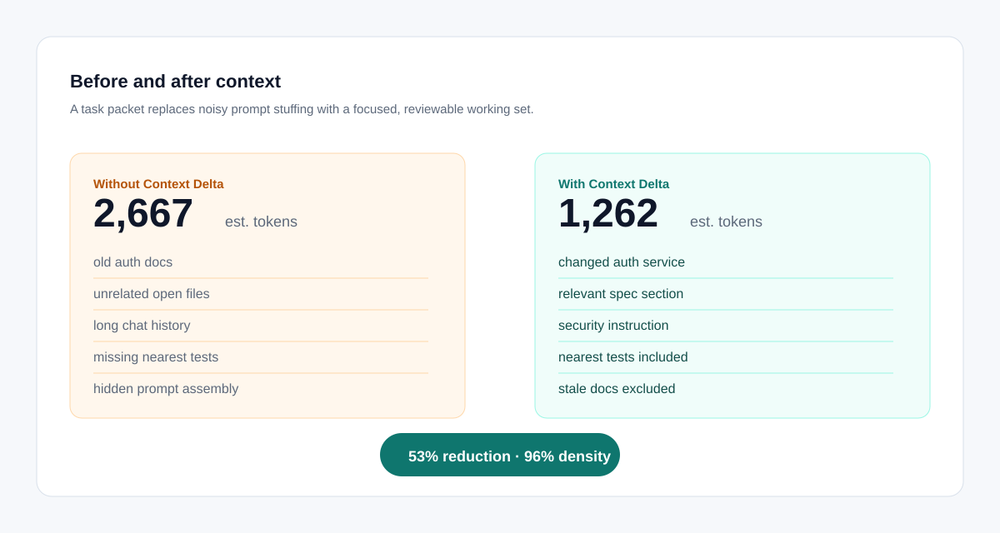
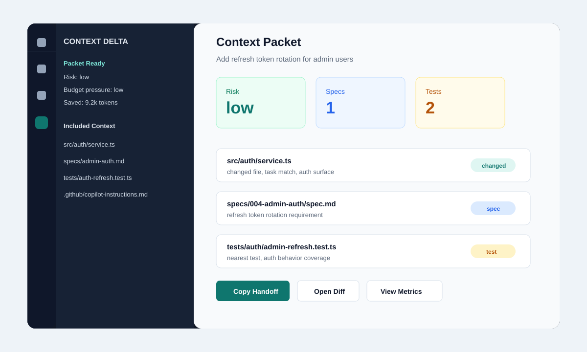
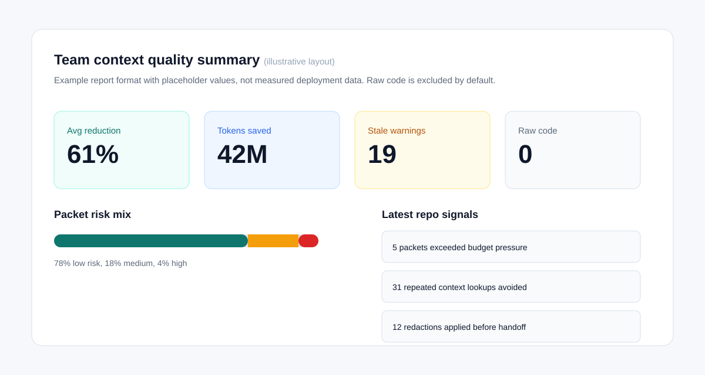

# Context Delta

**The context packet layer for AI coding agents.**

[](https://github.com/ContextDelta/context-delta-engine/actions/workflows/ci.yml)
[](LICENSE)
[](#quick-start)
[](#current-status)

[Website](https://contextdelta.github.io/context-delta-engine/) ·
[CLI](docs/cli.md) ·
[VS Code](docs/vscode-extension.md) ·
[MCP](docs/mcp-client-setup.md) ·
[Spec Kit](docs/spec-kit.md) ·
[Blog](docs/blog.html)

Context Delta is the context packet layer for AI coding agents: inspectable,
replayable, local-first by default, measurable, and portable across tools. It
helps GitHub Copilot, VS Code, Claude Code, Cursor, and MCP-compatible agents
work from a small, fresh packet before they make changes, with Codex-friendly
handoffs for local agent workflows.

Today, the CLI and MCP server work locally. Agent automation depends on the
host: MCP-capable agents can call `prepare_context`; VS Code/Copilot can use
the MCP setup when Agent mode and tools are enabled; other hosts can use the
prompt-ready handoff. The product direction is quiet by default: prepare
context automatically, show a simple risk line, and ask for attention only
when the packet looks risky.

AI coding tools are powerful. The problem is that they often receive messy
context: stale specs, long chat history, random open files, missing tests,
old instructions, and hidden prompt assembly. Context Delta finds what
changed, finds what matters, removes the noise, and shows what you can choose
to send.

```text
Your prompt
  -> Context Delta
  -> Fresh context packet
  -> GitHub Copilot / Claude Code / Cursor / MCP agent
```

## Why This Exists

Modern AI coding often fails for ordinary reasons:

- the agent sees an old spec instead of the current requirement
- the related test file is missed
- a security instruction is buried in repo docs
- the prompt contains too much unrelated context
- nobody can see what the agent actually used

Context Delta treats context as a working set, not a pile of files.

Before the AI acts, it builds a focused packet:

- what changed
- what is affected
- which spec sections matter
- which tests are nearby
- which repo instructions apply
- what was excluded and why
- how many tokens were likely saved



## What You Get

| Surface | What it does |
| --- | --- |
| CLI | Prepares agent-ready handoffs, packets, drift reviews, reports, diffs, summaries, and metrics from the terminal. |
| VS Code | Defaults to prepare-and-copy for Codex, Claude, and Copilot, with setup checks and advanced packet review available when needed. |
| MCP server | Lets compatible agents call one primary tool, `prepare_context`, before they work. |
| Metrics | Emits aggregate token savings, risk, budget, freshness, and redaction signals without raw code by default. |
| Eval | Scores packets against labeled gold sets so correctness claims are earned. |
| Spec workflow | Connects specs, tasks, tests, code, and instructions into one visible working set. |

## The Product Promise

Keep using your existing workflow.

Context Delta should run underneath the tools developers already use:

- GitHub Copilot and VS Code
- Claude Code
- Cursor
- MCP-compatible coding agents
- Spec Kit
- spec-driven development workflows

You should not need to switch IDEs, rewrite your process, or manually paste
giant context blocks. The default experience should be quiet and fast. The
details should be visible when you want to inspect them.

## How It Helps In Normal Agent Work

You still ask Codex, Claude Code, or GitHub Copilot for the change. Context
Delta helps in the step before the agent edits:

1. The agent calls `prepare_context`, or VS Code runs prepare-and-copy.
2. Context Delta builds a focused handoff from git changes, specs, tests,
   instructions, and policy exclusions.
3. The agent works from that handoff instead of guessing from open tabs or a
   hidden prompt.
4. After the agent edits, `drift` shows whether files changed outside the
   packet so you know when to rebuild or inspect.

The packet is the audit trail. It is there when risk is high, but it is not
the default workflow.

## What Works Today

| Path | Current state |
| --- | --- |
| CLI handoff | Works locally with `npm run prepare -- "task"` and `npm run drift`. |
| MCP agent path | Works when the host exposes MCP tools and the `context-delta` server is enabled. |
| GitHub Copilot in VS Code | Works through Copilot Agent mode when VS Code MCP tools are enabled; otherwise use prepare-and-copy. |
| VS Code extension | Alpha preview. It can prepare/copy handoffs, show packets, and review drift, but it is not marketplace-packaged yet. |
| Automatic interception | Host-dependent. Context Delta cannot intercept a closed agent chat unless that host calls MCP/tools or exposes hooks. |

## Dependency graph and languages

Impact selection is a deterministic, local dependency graph — no embeddings, no
model calls. It follows imports and re-exports with multi-hop transitive impact
(distance-decayed), and adds two traceability edges: **coverage edges** (the
tests that actually import the changed code) and **spec→code edges** (the spec
sections that reference it). Import resolution works for **JavaScript /
TypeScript** (incl. barrel re-exports and dynamic imports), **Python**
(relative and intra-repo absolute imports, pytest files), and **Go**
(module-aware package imports). Other languages still benefit from ranking,
git/snapshot change detection, and same-directory signals.

The whole pipeline — packet assembly, the graph, tokenization, baselines, and
the analytics rollup — is exercised end to end against the live MCP server by
`npm run e2e`.

## What A Developer Sees

Run:

```bash
npm run prepare -- "Add refresh token rotation for admin users"
```

Output:

```text
Context ready · risk=low · budget=low · warnings=0 · tests=2 · specs=1
Packet is ready for spec-driven AI coding.
```

The handoff below the header is prompt-ready. In MCP-capable agents, the agent
should call `prepare_context` first and use the returned handoff directly. In
VS Code, the dashboard keeps advanced review available without making it the
default workflow.

Inspecting the packet shows:

- packet insight and risk level
- recommended next steps
- included files and snippets
- reasons for inclusion
- excluded files and reasons
- changed vs unchanged context
- estimated token cost
- freshness warnings
- pin, exclude, expand, and compact controls

## Quick Start

Install dependencies if needed:

```bash
npm install
```

Check the workspace:

```bash
npm run doctor
```

Check the path you want to use:

```bash
npm run setup -- --target cli
npm run setup -- --target mcp
npm run setup -- --target vscode
```

For MCP-capable agents, copy the host config and let the agent call
`prepare_context` before it edits:

```bash
npm run doctor -- --mcp
```

For manual handoff, prepare context for your current agent:

```bash
npm run prepare -- "Add refresh token rotation for admin users"
```

After an agent edits files, check whether it drifted outside the packet:

```bash
npm run drift
```

Build the raw packet only when you want to inspect the audit trail directly:

```bash
npm run packet -- "Add refresh token rotation for admin users"
```

Generate a local HTML report:

```bash
npm run packet -- "Add refresh token rotation for admin users" --report
```

Review the latest packet without source snippets:

```bash
npm run context-delta -- compact
```

See packet readiness and recommendations:

```bash
npm run context-delta -- insights
```

Run the alpha release check:

```bash
npm run release:check
```

Copy a prompt-ready handoff for Copilot or another agent:

```bash
npm run handoff -- --format copilot
```

Score packet quality against the multi-shape labeled gold set:

```bash
npm run eval:multi
```

On the bundled gold set (auth change, static-site review, JavaScript, Python,
TypeScript, and Go service/test fixes, plus a precision case with decoy
modules), the current engine measures:

| Metric | Result |
| --- | --- |
| Cases passed | 7 / 7 (100%) |
| Useful-context density | 96% average |
| Impact coverage | 100% average |
| Omission rate | 0% average |
| Whole-workspace context reduction | 82% average |

These are the only quality numbers Context Delta claims, and they are
reproducible from a clean checkout with the command above. Token reduction is
an estimated cost signal; the pass rate, coverage, and density are the
measured quality signal.

Record a local review decision and create a replay prompt:

```bash
npm run approve
npm run replay
```

For a no-risk demo workspace:

```bash
npm run packet -- "Add admin refresh token rotation" --workspace examples/demo-workspace --dry-run
npm run handoff -- --workspace examples/demo-workspace --format copilot
```

Compare the latest packet with the previous one:

```bash
npm run diff
```

Write a manager-friendly repo summary:

```bash
npm run summary
```

Create a config file:

```bash
npm run init
```

## Example

You ask:

```text
Add refresh token rotation for admin users.
```

Without Context Delta, a naive agent would likely pull:

```text
~2,493 tokens (estimated naive-agent baseline)
old auth specs, unrelated open files, long chat history, random docs,
and no focused explanation of what changed
```

With Context Delta, the agent receives:

```text
~645 tokens delivered
changed auth service, affected token store, relevant spec requirement,
security instruction, nearest tests, and excluded stale docs

Context reduction: 74% (vs naive agent) · counted with an exact tokenizer
```

These are real figures from the bundled demo workspace — delivered tokens are
counted with an exact tokenizer (configurable per model), not illustrative.
Reproduce them with:

```bash
npm run packet -- "Add refresh token rotation for admin users" \
  --workspace examples/demo-workspace --json
```

The goal is not smaller context for its own sake. The goal is better context:
fresh enough to be reliable, rich enough to be correct, and visible enough
to trust. Token reduction is a cost signal; the packet-quality eval below is
the quality signal.

## Honest baselines, not one cherry-picked number

"How much did it save?" depends entirely on what you compare against, so
Context Delta reports reduction against a transparent spectrum instead of a
single flattering figure. Every packet includes a `baselines` block:

| Baseline | What it assumes |
| --- | --- |
| `open_files_only` | A disciplined developer who shares only the changed and most recently edited files (conservative floor). |
| `naive_agent` | An agent that also pulls full specs, instruction files, and a chat-history allowance (the typical, headline case). |
| `whole_repo` | The entire directly-useful repository text (upper bound). |

Each carries its own token estimate and reduction percentage, and the set is
constructed to stay ordered (floor ≤ typical ≤ ceiling). Reduction against the
conservative floor is the smallest, most defensible claim; against the whole
repo it is the largest. Showing all three is the point — the savings number is
auditable, not selected. Delivered tokens are measured with a real tokenizer
(configurable per model); size-derived baselines use a chars-per-token ratio
calibrated from each packet's own content.

## Product Preview



The VS Code extension is designed to keep context review in the editor:
packet status, included files, reasons, warnings, diffs, summaries, reports,
and handoff actions all point back to the same local engine.

## For Spec-Driven Development

Spec-driven development helps teams describe what should be built.

Context Delta helps AI agents understand which parts of the spec, code,
tests, docs, and history matter right now.

That makes Context Delta a complement to Spec Kit and similar workflows:

```text
Spec-driven development: define intent
Context Delta: deliver the right intent to the agent at the right moment
```

As specs evolve, the hard problem becomes knowing which requirements are
current, which are stale, which code implements them, and which tests prove
them. Context Delta is designed to make that working set visible.

## For Engineering Leaders

Context quality should be measurable.

Context Delta emits privacy-safe local metrics today:

- estimated input tokens saved
- average packet size
- files/specs/tests included per task
- files excluded as stale or noisy
- manual override rate (pins and excludes)
- stale spec warnings

Planned: repeated-context lookups avoided.

At team scale, those metrics can become repo and org summaries. The block
below is an illustration of the report *format* with placeholder numbers, not
measured results from any deployment:

```text
This month (illustrative format, not real data):
- estimated input tokens saved
- average context reduction
- packets accepted without edits
- stale spec warnings
- repeated-context lookups avoided
```

Acceptance and adoption numbers depend on real usage, so Context Delta does
not ship invented totals. The only numbers it claims today are the
reproducible eval results below.

Raw source code and prompt text should not be included in metrics by default.



## How It Works

Context Delta has five layers:

1. **Collect signals**
   Active files, local snapshots, git diff when available, specs, docs,
   tests, instructions, diagnostics, and recent context packets.

2. **Understand change**
   Detect changed files, changed requirement units, related symbols,
   affected tests, and likely stale context.

3. **Build the packet**
   Rank context by relevance, freshness, impact, and trust. Pack only the
   useful pieces into a bounded context packet.

4. **Show the packet**
   Let users see what will be sent, why it was included, what was excluded,
   and how much context was saved.

5. **Deliver to agents**
   Expose the packet through a VS Code extension, MCP server, and agent
   workflow integrations.

## Current Status

Context Delta is an early open-source alpha with a working local prototype.

Implemented in this repo:

- local workspace scanner
- git status detection when git is available
- local snapshot diffing when git is not available
- markdown/spec/instruction parsing
- first context packet builder
- token and context reduction estimates
- local packet and metrics output under `.contextdelta/`
- heuristic useful-context density and honest workspace upper-bound token baselines
- packet-quality eval harness with labeled gold-set scoring
- AGENTS.md, CLAUDE.md, Copilot, Cursor, and generic instruction precedence
- source graph neighbor detection for changed files
- packet insights, risk level, recommendations, and compact previews
- packet approval and replay artifacts
- packet history and previous/current packet diffs
- prompt-ready handoff formats for Copilot, Spec Kit, Markdown, replay, compact JSON, and full JSON
- CLI commands for setup, prepare, packet, scan, snapshot, metrics, report, insights, compact, history, diff, drift, handoff, summary, eval, approve, replay, init, and doctor
- config file support with pin/exclude controls
- policy exclusions and secret redaction
- local HTML report and manager summary generation
- MCP stdio server with packet, compact, insight, diff, handoff, summary, report, scan, and metrics tools
- VS Code extension with activity bar dashboard, packet item actions, handoff copy, diff, summary, report, insight, and metrics webviews
- demo workspace for quick manual testing
- GitHub Pages landing page under `docs/index.html`
- CI workflow for tests and syntax checks
- tests for scanner, packet building, instruction precedence, graph neighbors, git/no-git deltas, history/diff, handoff, eval, approval/replay, metrics summary, MCP, and CLI output

## Roadmap

Near term:

- publish and expand the packet-quality gold set
- improve semantic ranking quality
- add richer diff hunks and source snippets
- harden VS Code extension packaging
- validate MCP server compatibility with more real hosts
- add packet approval flow in the editor
- expand the redaction test corpus
- add more language-aware symbol extraction

Next:

- tree-sitter or LSP-backed symbol graph
- richer token estimation by model family
- packet replay and trend views
- deeper Spec Kit folder detection
- richer spec/plan/tasks parsing
- GitHub Action packet reports

Later:

- repo metrics export
- team dashboard
- policy controls
- multi-repo impact analysis
- enterprise deployment options

See [docs/roadmap.md](docs/roadmap.md) for the working roadmap.

## Project Docs

- [Vision](docs/vision.md)
- [Positioning](docs/positioning.md)
- [Spec-driven development](docs/spec-driven-development.md)
- [Spec Kit workflows](docs/spec-kit.md)
- [GitHub Copilot workflows](docs/github-copilot.md)
- [CLI](docs/cli.md)
- [Configuration](docs/configuration.md)
- [Insights and previews](docs/insights-and-previews.md)
- [Observability](docs/observability.md)
- [Testing](docs/testing.md)
- [Packet-quality eval](docs/eval.md)
- [VS Code extension](docs/vscode-extension.md)
- [MCP integration](docs/mcp.md)
- [MCP client setup](docs/mcp-client-setup.md)
- [MCP multi-host conformance](docs/mcp-conformance.md)
- [User experience](docs/user-experience.md)
- [Metrics](docs/metrics.md)
- [Launch checklist](docs/launch-checklist.md)
- [Release readiness](docs/release.md)
- [Demo script](docs/demo-script.md)
- [Known limitations](docs/known-limitations.md)
- [GitHub Pages landing page](docs/site/README.md)
- [VS Code experience handoff](docs/vscode-experience-handoff.md)
- [Scaling](docs/scaling.md)
- [Go to market](docs/go-to-market.md)
- [Architecture](docs/architecture.md)
- [Edge cases](docs/edge-cases.md)
- [Research notes](docs/research-notes.md)

## License

Apache-2.0. See [LICENSE](LICENSE).

## Trademark Notice

Context Delta is an independent open-source project. It is not affiliated
with GitHub, Microsoft, Anthropic, Cursor, OpenAI, or the Spec Kit project.
